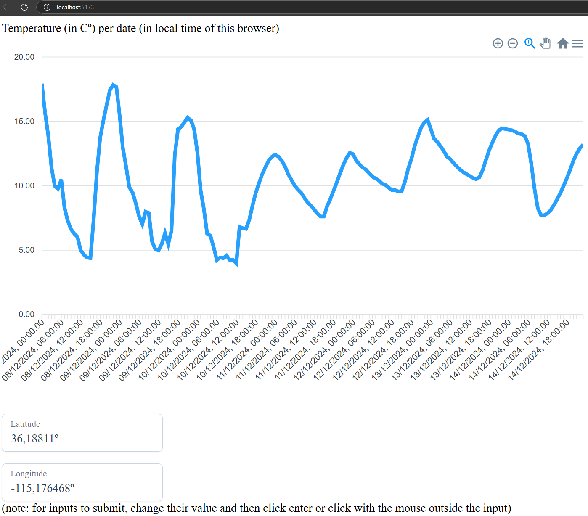

# weather-dashboard

## Description

Weather dashboard using the Open-Meteo public weather API, which displays both historical and forecasted temperature data for a selected location. 
The implementation was done following DDD, and using Vue 3, with Typescript files, and Vite as the unit test framework.



## Project creation details

The project was initially created by running

```
npm create vue@latest
```

and was configured to use Vue 3, with Typescript files, and Vite as the testing framework.

## Project setup

```
npm install
```

### Compile and hot-reload for development

```
npm run dev
```

### Run unit tests with [Vitest](https://vitest.dev/)

```
npm run test:unit
```

## Technical notes

The code is done using DDD, avoiding anemic domain entities (so, having all domain entities with proper meaning) and following the "always valid domain model" concept, where all entities should always be valid.

To make it simpler to understand which files are mine, I only changed the files App.vue, main.ts, base.css and main.css from the original files created using the "create vue" command.

I have put all files that I created under the directories "src/all-tiago-new-files" and "test/all-tiago-new-files", to make it easier to understand which files are mine.
In a real-world scenario I would naturally have these files incorporated in the proper places of the project, and would delete all unnecessary boilerplate files created by the "create vue" command.

I went for a simple DDD approach with a layered architecture.

My domain classes are all under the /entities folder.

For the layered architecture, I have the /apis folder which acts as a "repository" layer given that our "repo" is the gateway, and I have the /services folder which is my "business" layer (in this case it is simply calling the API method, but I believe it makes sense to distinguish them so that I only need to use the services in the component).

- I could have used distinct sets of classes for: (i) the entities of the domain layer, and (ii) the weather API gateway response; and then could have done some mappers between both sets of classes, but it felt too much of an overkill for this simple project.

I also created a specific file under the /infrastructure folder, to do dependency injection in a really minimal way. I did it in a minimal way to avoid over killing this small project, and I believe it is enough to show the concept.

All tests are under test/all-tiago-new-files. They were in an initial version of the project, so I will need to revisit them after I some of the changes I did.

For the UI, I used two simple external libraries, one for the inputs, and another for the plot (see list in the "External libraries used" section).

I ended up putting the inputs directly in the App.vue, and then putting the plot in a separate WeatherPlot.vue component. I could have gone fancier, but this already shows some core concepts regarding passing the latitude and longitude from their components to the WeatherPlot.vue component.

Then I made the WeatherPlot.vue, which interacts with the logic of calling the Open-Meteo API via the weatherService. Again, I could have gone fancier, but I ended up simply re-rendering the graph any time that the latitude/longitude changes. I believe this is already enough to show some core concepts, such as:

- Conditional rendering with the v-ifs in the WeatherPlot.vue
- Watching for changes in the latitude and longitude values to trigger an update of the component, and calling the "backend" logic to do that update (via the UpdatePlot calling the "backend" method weatherService.getWeather)
  - I could have gone fancier with the UpdatePlot, but I believe that the core part was to call the weatherService.getWeather method and do some minimal error handling

I ended up not doing any tests to the App.vue and WeatherPlot.vue components.

## External libraries used

Open-Meteo (for the meteorology data)

```
npm install openmeteo
```

Prime Vue (for the input buttons of the coordinates):

```
npm install primevue
npm install @primevue/themes
```

Apex Charts (for the plot)

```
npm install vue3-apexcharts
```

option-t (for error handling)

```
npm install option-t
```

shallow-equal-object (for shallow equality)

```
npm install shallow-equal-object
```

Vitest (for unit test)

```
installed in the initial setup with the "create vue" command
```
